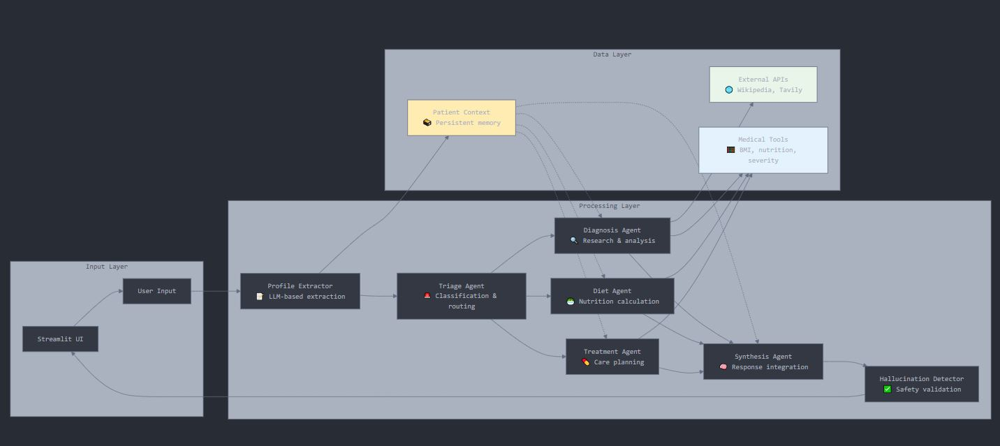
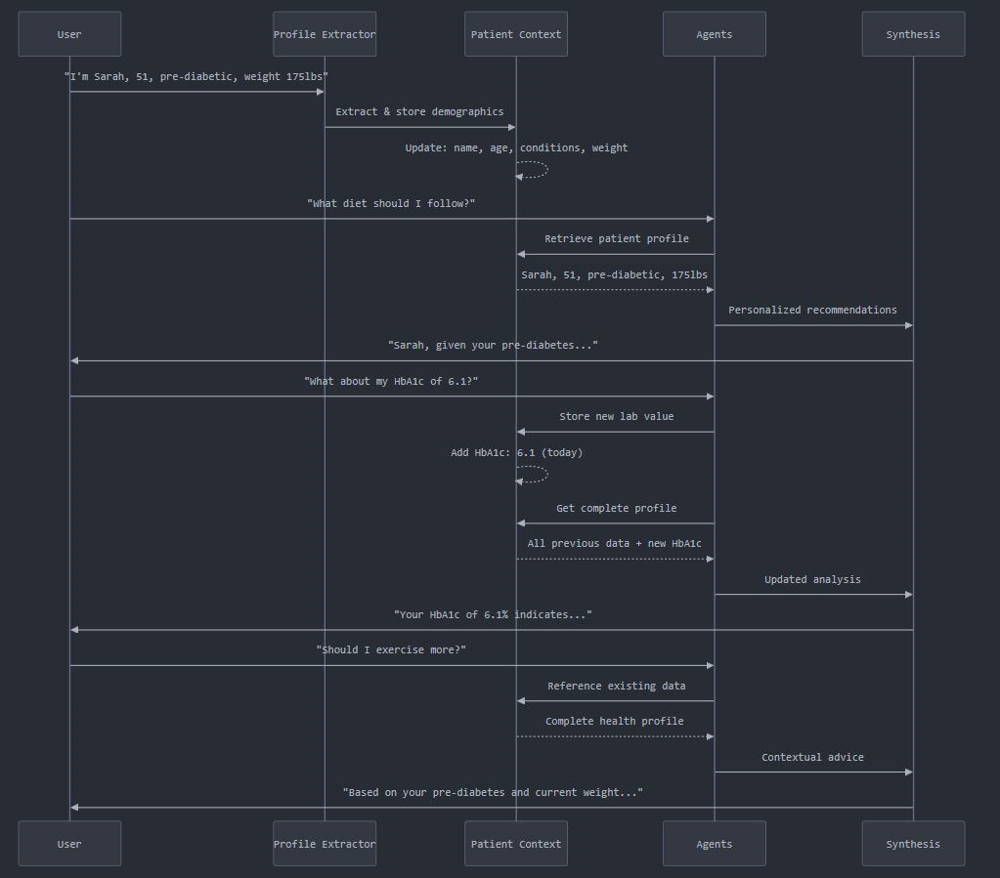

# 🏥 HealthBot - Multi-Agent AI Health System

An advanced multi-agent AI system for health education and symptom analysis, built with LangChain and Streamlit. This system uses 8 specialized AI agents with persistent memory to provide personalized health guidance.

## 🎯 What It Does

- **Intelligent Triage**: Classifies health queries and routes to appropriate agents
- **Symptom Analysis**: Researches symptoms using Wikipedia and web sources
- **Personalized Recommendations**: Provides diet, treatment, and lifestyle advice
- **Patient Memory**: Tracks conditions, medications, lab values across sessions
- **Safety Validation**: Multiple layers of medical accuracy checking
- **Smart Routing**: 60% faster responses for follow-up questions

## ⚠️ What It Does NOT Do

- **Does not diagnose medical conditions**
- **Does not prescribe medications**
- **Does not replace professional medical care**
- **Not suitable for medical emergencies**
- **Educational purposes only**

## 🏗️ System Architecture

### Multi-Agent Pipeline

1. **Profile Extractor**: Extracts patient information using structured LLM
2. **Triage Agent**: Classifies urgency and determines routing
3. **Diagnosis Agent**: Researches symptoms with external sources
4. **Diet Agent**: Calculates nutrition needs and dietary recommendations
5. **Treatment Agent**: Provides care guidance and scheduling
6. **Synthesis Agent**: Integrates all outputs into coherent response
7. **Coherence Checker**: Ensures continuity and personalization
8. **Hallucination Detector**: Validates medical accuracy and safety

## 📊 Workflow Diagrams

### Main Processing Flow


The primary workflow shows intelligent routing where the Triage Agent determines which specialized agents to activate based on query complexity and type.

### System Architecture Overview



Complete multi-agent architecture displaying data flows between processing layers, external APIs, and persistent patient context storage.

### Patient Memory Evolution



Demonstrates how patient context accumulates across conversation sessions, enabling personalized responses that reference previous interactions and stored health data.

## 📁 Project Structure

```
healthbot/
├── main.py                     # Streamlit web interface
├── multi_agent_health_system.py # Core multi-agent system
├── extended_schemas.py         # Pydantic models and type definitions
├── extended_tools.py          # LangChain tools for calculations and search
├── config.py                  # Configuration and personalities
├── requirements.txt           # Python dependencies
└── README.md                 # This file
```

### Key Components

- **`MultiAgentHealthSystem`**: Main orchestrator class managing agent workflow
- **`PatientContext`**: Persistent patient data structure
- **`UserInput`**: Standardized input schema
- **Agent Results**: Structured outputs from each specialized agent

## 🚀 Features

### Persistent Memory

- Tracks patient demographics, conditions, medications
- Maintains symptom timeline across conversations
- Stores lab values with date tracking
- Remembers lifestyle factors and preferences

### Smart Performance

- Conditional agent activation based on query type
- Progress tracking for complex analyses
- Streaming response display
- Real-time agent status monitoring

### Safety & Validation

- Medical disclaimer enforcement
- Dangerous content filtering
- Accuracy verification
- Professional care emphasis

## 🛠️ Installation

### Prerequisites

- Python 3.8+
- OpenAI API key
- Tavily API key (optional, for web search)

### Setup

1. **Clone repository**

```bash
git clone https://github.com/yourusername/healthbot.git
cd healthbot
```

2. **Install dependencies**

```bash
pip install -r requirements.txt
```

3. **Set environment variables**

```bash
export OPENAI_API_KEY="your-openai-api-key"
export TAVILY_API_KEY="your-tavily-api-key"  # Optional
```

4. **Run application**

```bash
streamlit run main.py
```

## 📋 Requirements

```
streamlit>=1.28.0
langchain>=0.0.340
langchain-openai>=0.0.2
langchain-community>=0.0.10
langgraph>=0.0.20
pydantic>=2.0.0
python-dotenv>=1.0.0
```

## ⚙️ Configuration

### Personality Modes

- **Concise**: Direct, bullet-point responses (500 tokens)
- **Friendly**: Warm, empathetic responses (1000 tokens)
- **Professional**: Clinical, formal responses (800 tokens)

### AI Parameters

- Temperature: 0.0-1.0 (default: 0.3)
- Top-p: 0.0-1.0 (default: 0.9)
- Max tokens: 100-2000 (default: 1000)

## 🔧 Usage

### Basic Health Query

```
User: "I have a headache and feel tired"
System: → Profile extraction → Triage → Full analysis → Response
```

### Follow-up Questions

```
User: "What about the medication you mentioned?"
System: → Quick processing → Contextual response (60% faster)
```

### Patient Profile Building

The system automatically extracts:

- Demographics (age, gender, height, weight)
- Medical history and conditions
- Current medications and allergies
- Lifestyle factors (smoking, exercise, diet)
- Lab values and symptoms timeline

## 🔒 Privacy & Security

- **No data persistence**: Sessions are temporary
- **Local processing**: Patient data stays in browser session
- **No external storage**: No databases or file saving
- **Medical disclaimers**: Clear educational-only messaging

## 🧪 Technical Implementation

### LangChain Integration

- Custom tools for medical calculations
- Wikipedia and Tavily search integration
- Structured LLM outputs with Pydantic
- State management with LangGraph

### Multi-Agent Coordination

- Conditional routing based on triage results
- Shared state across all agents
- Memory persistence within sessions
- Cross-agent validation and synthesis

## 📊 Performance

- **Routing Efficiency**: 60% faster for follow-up queries
- **Response Time**: 2-8 seconds for complex analyses
- **Memory Usage**: Minimal - session-based only
- **Accuracy**: Multiple validation layers

## 🚨 Limitations

- **Educational only**: Not for medical diagnosis
- **Session-based**: No long-term data storage
- **API dependent**: Requires OpenAI connectivity
- **English only**: Currently supports English language
- **General advice**: Not specialized for rare conditions

## 🤝 Contributing

1. Fork the repository
2. Create feature branch (`git checkout -b feature/enhancement`)
3. Commit changes (`git commit -am 'Add enhancement'`)
4. Push to branch (`git push origin feature/enhancement`)
5. Create Pull Request

## 📜 License

This project is licensed under the MIT License - see the [LICENSE](LICENSE) file for details.

## ⚖️ Legal & Ethical Considerations

- **Medical Disclaimer**: Always displayed to users
- **Professional Care**: Consistently emphasizes doctor consultation
- **Emergency Handling**: Redirects emergencies to proper care
- **Accuracy Focus**: Multiple validation layers for safety
- **Educational Purpose**: Clear positioning as learning tool

## 🆘 Support

For technical issues:

1. Check environment variables are set correctly
2. Verify API keys are valid and have credits
3. Ensure all dependencies are installed
4. Review console logs for specific errors

## 🔮 Future Enhancements

- Multi-language support
- Integration with health APIs
- Advanced analytics dashboard
- Specialized medical domain agents
- Enhanced visualization features

---

**Disclaimer**: This system is for educational purposes only and should not replace professional medical advice, diagnosis, or treatment. Always consult with qualified healthcare professionals for medical concerns.
